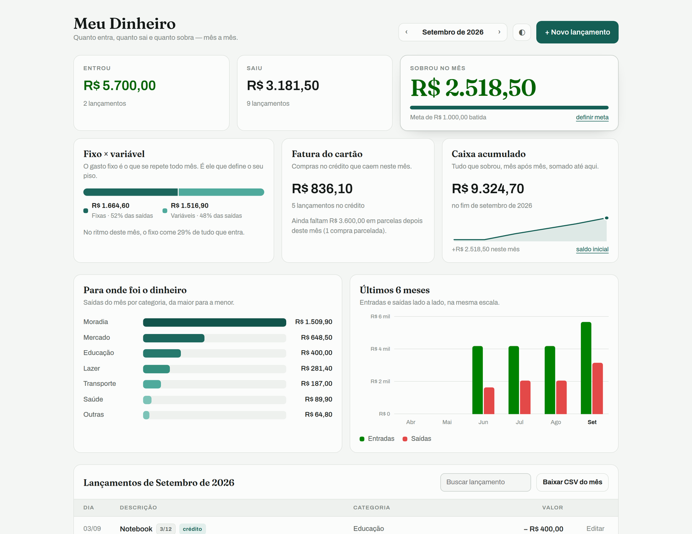
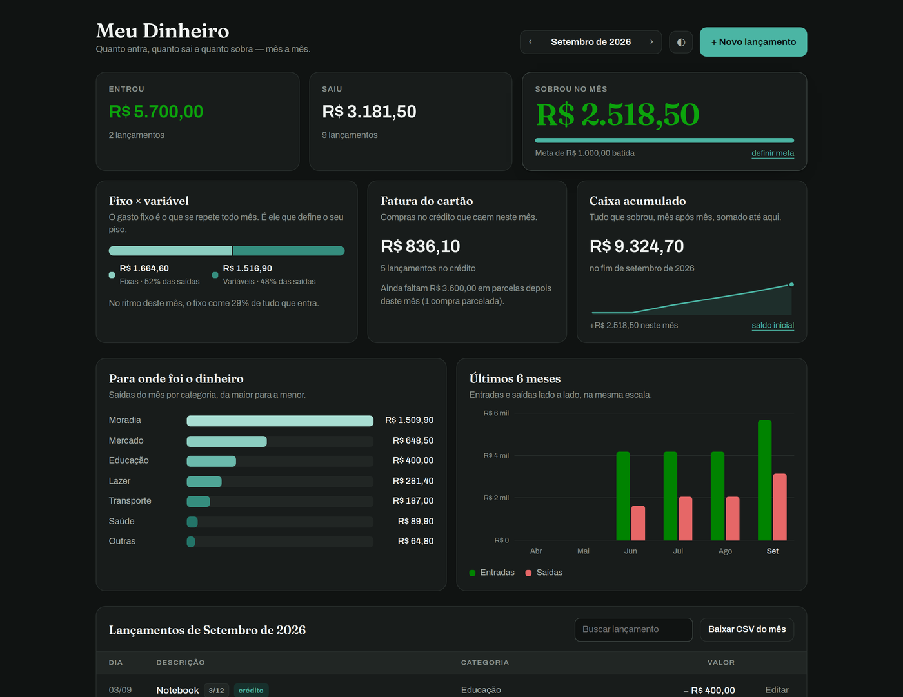
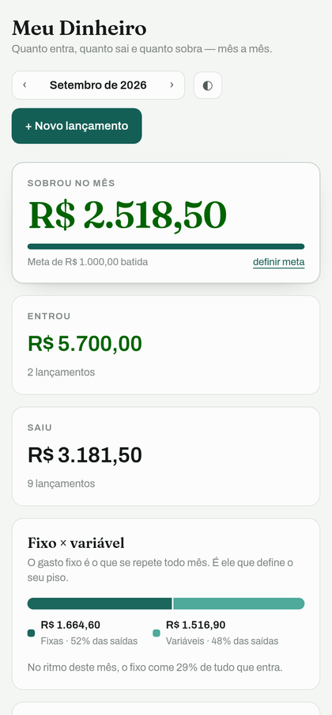

<h1 align="center">Meu Dinheiro</h1>

<p align="center">
  Quanto entra, quanto sai e quanto sobra, mês a mês.<br>
  <sub>Controle de gastos pessoal em JavaScript puro, com Postgres de verdade por trás.</sub>
</p>

<p align="center">
  <a href="https://kauanpfernandes.github.io/meu-dinheiro/?demo"></a>
</p>

<p align="center">
  <sub>Abre com dados de exemplo, sem cadastro e sem login. Dá para lançar, editar e navegar à vontade.</sub>
</p>

<p align="center">
  
  
  
  
  
</p>



## Por que eu fiz

Aplicativo de banco mostra extrato, não mostra decisão. Ele avisa que você gastou
R$ 3.181 no mês e para por aí. Não conta quanto disso já estava comprometido antes
de você acordar, quanto ainda vai cair de parcela nos próximos meses, nem se, no
ritmo de hoje, sobra alguma coisa no fim.

Eu queria essas três respostas numa tela só. Como não achei, construí.

## O que ele mostra

| | |
|---|---|
| **Sobrou no mês** | Entradas menos saídas, com barra de progresso contra a meta de economia. |
| **Fixo × variável** | Quanto das saídas é aluguel, internet e academia (repete sozinho) e quanto é escolha do mês. O app traduz isso numa frase: *"no ritmo deste mês, o fixo come 29% de tudo que entra"*. |
| **Fatura do cartão** | O que cai neste mês no crédito, e quanto ainda falta em parcelas **depois** dele. É o número que some do extrato e aparece na fatura. |
| **Caixa acumulado** | O que sobrou de cada mês, somado desde um saldo inicial, com a curva dos últimos 6 meses. |
| **Para onde foi** | Saídas do mês por categoria, da maior para a menor. |
| **Últimos 6 meses** | Entradas e saídas lado a lado, na mesma escala. |

Cada lançamento pode ser único, **fixo** (repete todo mês, com data-limite opcional)
ou **parcelado**. No parcelado você informa o valor total e o app divide sozinho,
uma parcela por mês, marcando `3/12` na linha.

Tem também busca nos lançamentos do mês, exportação em CSV, tema claro e escuro,
e dados de exemplo na primeira vez, para você ver a cara do app antes de digitar
qualquer coisa. É esse modo que roda na
**[demonstração](https://kauanpfernandes.github.io/meu-dinheiro/?demo)**: tudo
funciona, nada é salvo, nada sai do seu navegador.

<p align="center">
  
  
</p>

## Decisões técnicas

### Site estático falando direto com o banco

Não existe backend neste projeto. Nenhum servidor Node, nenhuma serverless
function, nenhuma variável de ambiente para configurar. O navegador conversa
direto com o Postgres do Supabase. Resultado: zero infraestrutura para manter e um
deploy que é arrastar uma pasta.

### A segurança mora no banco, não no código

A chave `anon` é pública de propósito. Ela sozinha não abre nada. Quem protege os
dados é o **RLS** do Postgres, com uma regra que vale para toda leitura e toda
escrita:

```sql
alter table public.lancamentos enable row level security;

create policy "cada um mexe nos proprios lancamentos"
  on public.lancamentos for all to authenticated
  using      (auth.uid() = user_id)
  with check (auth.uid() = user_id);
```

Mesmo que alguém pegue a chave no código-fonte da página, o banco só devolve as
linhas de quem está logado. A senha nunca passa perto do meu código: quem cuida
dela é o Supabase Auth.

### Recorrência calculada, não materializada

Um gasto fixo é **uma** linha no banco, não doze. Quando você navega para outubro,
o app projeta quais lançamentos aparecem naquele mês e com que valor. Isso mantém
a tabela pequena, deixa a edição retroativa trivial (mudou o aluguel, mudou em
todos os meses) e foge do clássico problema de "gerar as próximas ocorrências",
que nunca gera na hora certa.

### Sem framework e sem build

São cerca de 1.400 linhas num `index.html`: HTML, CSS com variáveis para os dois
temas, e JavaScript sem nenhuma dependência além do cliente do Supabase. Não é que
framework seja ruim. É que, para um app deste tamanho, ele seria a parte mais
pesada do projeto: a página inteira pesa menos que o bundle mínimo de qualquer um
deles.

### Instalável

Manifest, ícones e service worker. Dá para adicionar à tela de início do celular e
abrir em tela cheia, como um aplicativo qualquer. A casca do app fica em cache,
então ele abre offline. Os dados, esses sim, precisam de rede.

## Stack

`JavaScript` · `Supabase (Postgres + Auth + Row Level Security)` · `Netlify` · `PWA / Service Worker`

## Estrutura

```
public/index.html              o app inteiro, numa página só
public/config.js               URL e chave anon do projeto Supabase
public/manifest.webmanifest    metadados de instalação
public/sw.js                   service worker (cache da casca do app)
public/_headers                cabeçalhos de segurança
supabase.sql                   tabelas, índices e políticas de RLS
docs/SETUP.md                  como rodar isso na sua máquina
.github/workflows/pages.yml    publica a demonstração a cada push
```

## Rodando

O passo a passo completo está em **[docs/SETUP.md](docs/SETUP.md)**: criar o
projeto no Supabase, rodar o SQL, ligar o app e publicar.

## Licença

[MIT](LICENSE). Feito por [Kauan Fernandes](https://github.com/Kauanpfernandes) ·
[dev.fernandes](https://instagram.com/dev.fernandes)
